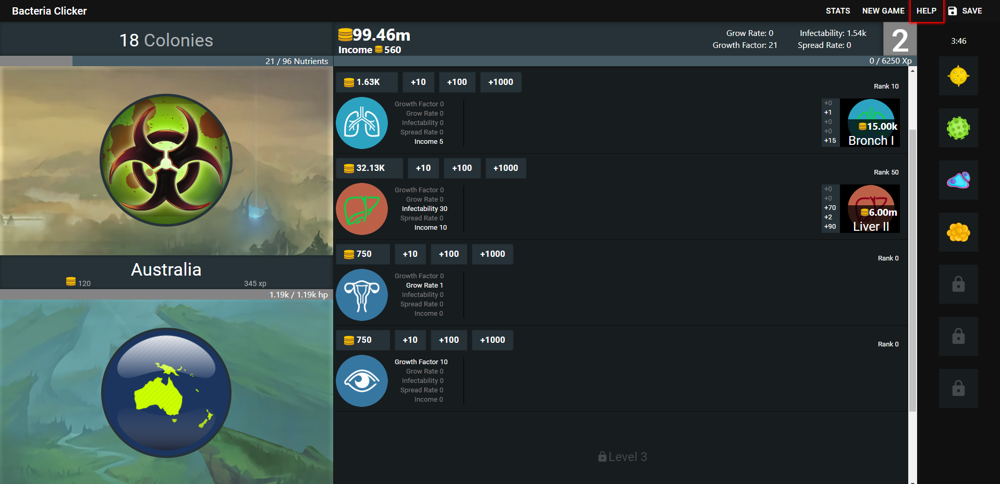

## Bacteria Clicker

Bacteria Clicker is a plague-themed incremental game created in React JS and hosted with Firebase.

Bacteria Clicker can be played [Here](https://bacteriaclicker.co).

### Running Locally

To Run Bacteria Clicker locally on your machine: 
    - Clone/download project on your machine. 
    - Run <code>npm install && npm start</code> to see Bacteria Clicker in action. 

### Screenshot

 
